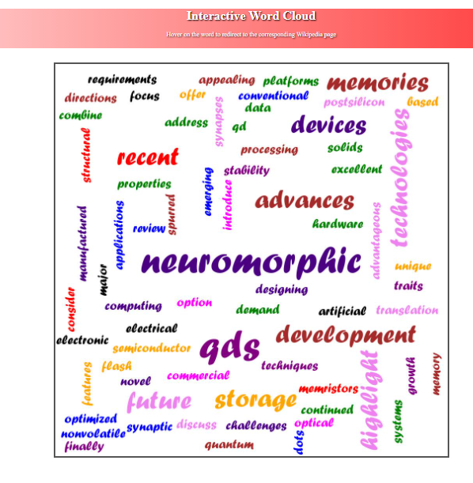

# tagcloud
fall 2020 project 01
# CECS450_Project1
## A word cloud is a collection, or cluster, of words depicted in different sizes. The bigger and bolder the word appears, the more often it’s mentioned within a given text and the more important it is.

## Description
* We take input from data.txt file and calculate he frequency of the words.
* The larger the frequency of the word, the bigger is the font size. 
* On hovering on the word, it will display the frequency.
* We used python, flask, HTML, CSS for this project.

## Installation

On the command prompt, type the following commands to install pillow(PIL) and flask. 

~~~bash
pip install flask
pip install pillow
~~~

## Usage
~~~bash
python project.py
~~~

* Open a web browser and go to - http://127.0.0.1:5000/fetch
* The website with Word cloud will be displayed.
* Hover on the text to see the frequency of the word.
* Click on the word to direct to the wikipedia page.

## preview of the web page

